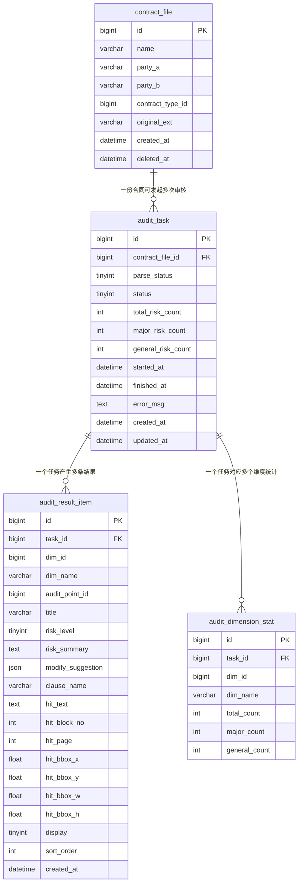

# 审核详情页技术设计

**版本**: v2.0  
**日期**: 2026-06-22

---

# 一、概要

## 1.1 背景

用户上传合同后，系统异步完成文件解析和 AI 审查，生成审查结果条目。审核详情页提供左右两栏布局：左侧渲染合同原文 PDF，右侧按维度和风险等级展示审查结果卡片，支持原文定位高亮。

## 1.2 功能目标

- **左栏**：pdf.js 渲染合同原文 PDF，支持按结果卡片跳转定位并高亮对应原文段落
- **右栏**：
  - 合同基本信息（名称、甲乙方、合同类型）
  - 维度 Tab 切换（基础核查 / 法务风险 / 财务风险 / 形式核查 / 全部）
  - 风险等级过滤（全部 / 重大风险 / 一般风险）
  - 风险结果卡片列表：标题、风险等级标签、概述、修改建议
  - 卡片支持展开/收起（`show` 字段控制展开状态，`display` 字段控制可见性）

## 1.3 核心设计决策

| 决策项 | 选择 | 说明 |
|--------|------|------|
| 左侧原文渲染 | pdf.js | 后端提供文件 URL，无需解析文本结构 |
| 文档批注 | 本期不实现 | - |
| 格式转换 | docx/doc → PDF → docling 解析 | .doc 先 LibreOffice 转 docx，再转 PDF |
| LLM 文本存储 | 按块拆分存 JSON，供 Prompt 构造 | 前端不直接使用 |
| 大模型调用 | 按维度（`audit_point`）分批调用 | 每个维度独立 Prompt，结果逐批写入 |
| 卡片展开控制 | 结果接口返回 `show`/`display` 字段 | 前端直接用，无需额外状态管理 |

## 1.4 方案要点

- 单库 MySQL，文件存储按 `task_id` 目录组织
- 审查规则来自配置中心（`audit_point` + `contract_type_audit_point`）
- 结果接口返回 `show`（是否展开）和 `display`（是否显示）两个展示控制字段，前端直接渲染

---

# 二、整体设计

## 2.1 系统架构

```
┌─────────────────────────────────────────────────────┐
│                  前端审核详情页                        │
│  左：pdf.js 渲染合同 PDF（支持高亮定位）               │
│  右：维度 Tab + 风险等级过滤 + 结果卡片列表            │
└────────────────────┬────────────────────────────────┘
                     │ REST API
┌────────────────────▼────────────────────────────────┐
│              审核服务（AuditService）                  │
│  规则来源：配置中心 audit_point + contract_type_audit_point │
└────────┬────────────────────────────┬───────────────┘
         │                            │
┌────────▼──────┐            ┌────────▼────────────┐
│    MySQL       │            │     文件存储          │
│  contract_file │            │  original.{ext}      │
│  audit_task    │            │  converted.pdf       │
│  audit_result_item │        │  blocks.json         │
│  audit_dimension_stat │     └─────────────────────┘
└───────────────┘
```

## 2.2 页面布局（参考原型截图）

```
┌──────────────────────────────────────────────────────────────┐
│  合同名称   甲方：xxx  乙方：xxx  合同类型：采购合同  [导出报告] │
├─────────────────────────┬────────────────────────────────────┤
│                         │  [基础核查2] [法务风险2] [财务风险1] │
│                         │  [形式核查1]  ← 维度 Tab           │
│   PDF 原文渲染区域        │  ──────────────────────────────── │
│   (pdf.js)              │  [全部] [重大风险] [一般风险]        │
│                         │  ← 风险等级过滤                     │
│   点击结果卡片           │  ──────────────────────────────── │
│   → 跳转对应页           │  ▼ 风险标题     [重大风险]          │
│   → 高亮命中段落         │    风险概述...                      │
│                         │    [展开] 修改建议1 / 建议2          │
│                         │  ──────────────────────────────── │
│                         │  ▼ 风险标题2    [一般风险]           │
└─────────────────────────┴────────────────────────────────────┘
```

## 2.3 数据流

**配置写入流**：管理员在配置中心维护 `dimension` → `audit_point` → `contract_type_audit_point`

**审核流**：
```
上传合同 → 格式转换 → docling 解析 → blocks.json
  → 从配置中心读取合同类型对应的 audit_point 列表
  → 按维度分批调用大模型（Prompt 含 blocks 文本）
  → 模型返回 hit_block_no → 后端回查 bbox → 写 audit_result_item
  → 汇总 audit_dimension_stat
```

**详情页读取流**：
```
GET /detail  → 合同信息 + 维度 Tab 统计
GET /results → 结果卡片列表（含 show/display 字段）
切换 Tab / 过滤 → GET /results?dim_id=&level=
点击卡片 → pdf.js scrollPageIntoView + 绘制高亮矩形
```

---

# 三、数据库设计

## 3.0 ER 图



## 3.1 合同文件表 `contract_file`

```sql
CREATE TABLE `contract_file` (
  `id`            BIGINT UNSIGNED NOT NULL AUTO_INCREMENT,
  `name`          VARCHAR(500)    NOT NULL COMMENT '合同名称',
  `party_a`       VARCHAR(200)             COMMENT '甲方名称',
  `party_b`       VARCHAR(200)             COMMENT '乙方名称',
  `contract_type_id` BIGINT UNSIGNED       COMMENT '关联合同类型ID（来自配置中心）',
  `original_ext`  VARCHAR(10)     NOT NULL COMMENT '原始格式 doc/docx/pdf',
  `created_at`    DATETIME        NOT NULL DEFAULT CURRENT_TIMESTAMP,
  `deleted_at`    DATETIME                 DEFAULT NULL,
  PRIMARY KEY (`id`)
) ENGINE=InnoDB DEFAULT CHARSET=utf8mb4;
```

> 文件路径通过 `task_id` 推导：`contracts/task_{task_id}/`，不存冗余路径字段。

## 3.2 审核任务表 `audit_task`

```sql
CREATE TABLE `audit_task` (
  `id`                 BIGINT UNSIGNED NOT NULL AUTO_INCREMENT,
  `contract_file_id`   BIGINT UNSIGNED NOT NULL,
  `parse_status`       TINYINT NOT NULL DEFAULT 0 COMMENT '0待解析 1解析中 2完成 3失败',
  `status`             TINYINT NOT NULL DEFAULT 0 COMMENT '0待审核 1审核中 2完成 3失败',
  `total_risk_count`   INT     NOT NULL DEFAULT 0,
  `major_risk_count`   INT     NOT NULL DEFAULT 0,
  `general_risk_count` INT     NOT NULL DEFAULT 0,
  `started_at`         DATETIME         DEFAULT NULL,
  `finished_at`        DATETIME         DEFAULT NULL,
  `error_msg`          TEXT             COMMENT '失败原因',
  `created_at`         DATETIME NOT NULL DEFAULT CURRENT_TIMESTAMP,
  `updated_at`         DATETIME NOT NULL DEFAULT CURRENT_TIMESTAMP ON UPDATE CURRENT_TIMESTAMP,
  PRIMARY KEY (`id`),
  KEY `idx_file` (`contract_file_id`),
  KEY `idx_status` (`status`)
) ENGINE=InnoDB DEFAULT CHARSET=utf8mb4;
```

## 3.3 审核结果条目表 `audit_result_item`

```sql
CREATE TABLE `audit_result_item` (
  `id`              BIGINT UNSIGNED NOT NULL AUTO_INCREMENT,
  `task_id`         BIGINT UNSIGNED NOT NULL,
  `dim_id`          BIGINT UNSIGNED NOT NULL COMMENT '维度ID（来自配置中心 dimension.id）',
  `dim_name`        VARCHAR(100)    NOT NULL COMMENT '维度名称冗余，防止改名影响历史',
  `audit_point_id`  BIGINT UNSIGNED NOT NULL COMMENT '触发该结果的审查点ID',
  `title`           VARCHAR(500)    NOT NULL COMMENT '风险标题',
  `risk_level`      TINYINT         NOT NULL COMMENT '1重大风险 2一般风险',
  `risk_summary`    TEXT            NOT NULL COMMENT '风险概述',
  `modify_suggestion` JSON          NOT NULL COMMENT '修改建议，字符串数组',
  `clause_name`     VARCHAR(200)             COMMENT '所属条款名称',
  `hit_text`        TEXT                     COMMENT '命中的合同原文片段',
  `hit_block_no`    INT                      COMMENT '命中块序号（对应 blocks.json）',
  `hit_page`        INT                      COMMENT '命中页码',
  `hit_bbox_x`      FLOAT                    COMMENT 'PDF bbox x（points，左下角原点）',
  `hit_bbox_y`      FLOAT                    COMMENT 'PDF bbox y',
  `hit_bbox_w`      FLOAT                    COMMENT 'bbox 宽度',
  `hit_bbox_h`      FLOAT                    COMMENT 'bbox 高度',
  `display`         TINYINT NOT NULL DEFAULT 1 COMMENT '1显示 0已忽略（用户手动忽略）',
  `sort_order`      INT     NOT NULL DEFAULT 0,
  `created_at`      DATETIME NOT NULL DEFAULT CURRENT_TIMESTAMP,
  PRIMARY KEY (`id`),
  KEY `idx_task` (`task_id`),
  KEY `idx_task_dim` (`task_id`, `dim_id`),
  KEY `idx_task_level` (`task_id`, `risk_level`)
) ENGINE=InnoDB DEFAULT CHARSET=utf8mb4;
```

## 3.4 审核维度统计表 `audit_dimension_stat`

```sql
CREATE TABLE `audit_dimension_stat` (
  `id`            BIGINT UNSIGNED NOT NULL AUTO_INCREMENT,
  `task_id`       BIGINT UNSIGNED NOT NULL,
  `dim_id`        BIGINT UNSIGNED NOT NULL,
  `dim_name`      VARCHAR(100)    NOT NULL,
  `total_count`   INT NOT NULL DEFAULT 0,
  `major_count`   INT NOT NULL DEFAULT 0,
  `general_count` INT NOT NULL DEFAULT 0,
  PRIMARY KEY (`id`),
  UNIQUE KEY `uk_task_dim` (`task_id`, `dim_id`)
) ENGINE=InnoDB DEFAULT CHARSET=utf8mb4;
```

## 3.5 文件存储路径规范

```
contracts/
└── task_{task_id}/
    ├── original.{ext}    # 原始上传文件
    ├── converted.pdf     # 转换后 PDF（pdf.js 渲染用）
    └── blocks.json       # docling 解析结果（供 LLM + 前端定位）
```

**blocks.json 结构**：

```json
{
  "total_pages": 18,
  "blocks": [
    {
      "no": 1,
      "page": 1,
      "text": "智慧园区软件采购合同",
      "bbox": { "x": 200, "y": 750, "width": 180, "height": 20 }
    }
  ]
}
```

坐标为 PDF user space（points，原点左下角），与 pdf.js viewport 坐标系一致。

---

# 四、核心流程

```
1. 用户上传合同
   → 写 contract_file，创建 audit_task（parse_status=1）
   → 存原始文件 contracts/task_{id}/original.{ext}

2. 异步转换 + 解析（parse_status: 1→2）
   .doc/.docx → LibreOffice → PDF → docling → blocks.json

3. 触发审核（status: 0→1）
   → 查 contract_file.contract_type_id
   → 从配置中心读关联的 audit_point 列表（按维度分组）

4. 按维度分批调用大模型
   → 每个维度：读 blocks.json，构造 Prompt（传 no + text，不传坐标）
   → 模型返回 hit_block_no → 后端回查 bbox → 写 audit_result_item
   → 更新 audit_dimension_stat

5. 所有维度完成（status: 1→2）
   → 汇总 total/major/general_risk_count 到 audit_task

6. 前端轮询 status=2 → 进入详情页
```

**大模型单条输出格式**：

```json
{
  "title": "主体信息缺失风险",
  "risk_level": 1,
  "risk_summary": "甲方信息不完整，名称、地址、法定代表人缺失",
  "modify_suggestion": ["补全甲方名称、地址、法定代表人及统一社会信用代码"],
  "clause_name": "主体信息条款",
  "hit_text": "甲方：华城数字建设有限公司",
  "hit_block_no": 3
}
```

`dim_id/dim_name` 由后端按当前批次填入，模型无需感知。

---

# 五、API 接口设计

**基础路径**：`/api/v1/audit`

## 5.1 上传合同文件

```
POST /upload
Content-Type: multipart/form-data
```

| 字段 | 类型 | 必填 | 说明 |
|------|------|------|------|
| file | file | 是 | 合同文件，支持 pdf/doc/docx |
| contractTypeId | number | 否 | 合同类型ID（来自配置中心） |

```json
{ "code": 0, "data": { "fileId": 1, "taskId": 123 } }
```

---

## 5.2 查询任务状态（轮询）

```
GET /tasks/:taskId/status
```

```json
{
  "code": 0,
  "data": {
    "parseStatus": 2,
    "status": 2,
    "totalRiskCount": 6,
    "majorRiskCount": 3,
    "generalRiskCount": 3,
    "finishedAt": "2026-06-22T10:20:00+08:00"
  }
}
```

前端 status=0/1 时每 2 秒轮询，status=2 进详情页，status=3 展示错误信息。

---

## 5.3 获取审核详情

```
GET /tasks/:taskId/detail
```

```json
{
  "code": 0,
  "data": {
    "contract": {
      "name": "智慧园区软件采购合同",
      "partyA": "华城数字建设有限公司",
      "partyB": "云启科技有限公司",
      "contractType": "采购合同"
    },
    "summary": {
      "totalRiskCount": 6,
      "majorRiskCount": 3,
      "generalRiskCount": 3
    },
    "dimensions": [
      { "dimId": 1, "dimName": "基础核查", "totalCount": 2, "majorCount": 2, "generalCount": 0 },
      { "dimId": 2, "dimName": "法务风险", "totalCount": 2, "majorCount": 1, "generalCount": 1 },
      { "dimId": 3, "dimName": "财务风险", "totalCount": 1, "majorCount": 0, "generalCount": 1 },
      { "dimId": 4, "dimName": "形式核查", "totalCount": 1, "majorCount": 0, "generalCount": 1 }
    ]
  }
}
```

---

## 5.4 获取风险结果列表

```
GET /tasks/:taskId/results
```

**Query 参数**：

| 参数 | 类型 | 必填 | 说明 |
|------|------|------|------|
| dimId | number | 否 | 按维度过滤，不传返回全部 |
| level | number | 否 | 1重大风险 2一般风险，不传返回全部 |
| showIgnored | bool | 否 | true=包含已忽略条目，默认 false |

**响应**（含前端展示控制字段 `show` 和 `display`）：

```json
{
  "code": 0,
  "data": {
    "items": [
      {
        "id": 1,
        "sortOrder": 1,
        "title": "主体信息缺失风险",
        "riskLevel": 1,
        "riskSummary": "甲方信息不完整，名称、地址、法定代表人均缺失，存在主体认定风险。",
        "modifySuggestion": [
          "补全甲方名称、注册地址、法定代表人及统一社会信用代码",
          "明确双方签章位置与确认方式"
        ],
        "clauseName": "主体信息条款",
        "dimName": "基础核查",
        "hitText": "甲方：华城数字建设有限公司",
        "hitPage": 1,
        "hitBbox": { "x": 90, "y": 710, "width": 150, "height": 16 },
        "show": true,
        "display": true
      },
      {
        "id": 2,
        "sortOrder": 2,
        "title": "默示验收风险",
        "riskLevel": 1,
        "riskSummary": "合同约定逾期未反馈视为自动验收，甲方利益受损。",
        "modifySuggestion": ["删除自动验收表述，改为双方签署书面验收单"],
        "clauseName": "验收条款",
        "dimName": "法务风险",
        "hitText": "若甲方在十个工作日内未提出书面异议，则视为项目自动验收通过。",
        "hitPage": 4,
        "hitBbox": { "x": 90, "y": 600, "width": 400, "height": 16 },
        "show": false,
        "display": true
      }
    ]
  }
}
```

**`show` / `display` 字段说明**：

| 字段 | 类型 | 说明 |
|------|------|------|
| `show` | bool | 卡片修改建议是否展开（true=展开，false=收起） |
| `display` | bool | 卡片是否显示（false 表示已被用户忽略，从列表中隐藏） |

> `show` 由后端按 `risk_level=1`（重大风险）默认设为 `true`，前端手动展开/收起时本地切换，无需持久化。  
> `display` 来自 `audit_result_item.display` 字段，默认 `1`，用户点击"忽略本条"后调用接口置为 `0`，持久化到 DB；`/results` 接口默认只返回 `display=1` 的条目，传 `showIgnored=true` 可返回全部。

---

## 5.5 忽略 / 恢复单条结果

```
PATCH /tasks/:taskId/results/:resultId/display
```

**请求**：

| 字段 | 类型 | 必填 | 说明 |
|------|------|------|------|
| display | number | 是 | 0=忽略，1=恢复显示 |

```json
{ "display": 0 }
```

**响应**：`{ "code": 0 }`

**业务规则**：
- 忽略后该条目 `audit_result_item.display = 0`，`/results` 默认查询不再返回
- 前端"忽略本条"按钮触发 `display=0`，可选"查看已忽略"时传 `showIgnored=true` 重新可见
- 忽略操作同步更新 `audit_dimension_stat` 对应维度的计数（减 1）

---

## 5.6 获取 PDF 文件地址

```
GET /tasks/:taskId/pdf-url
```

```json
{ "code": 0, "data": { "url": "/files/contracts/task_123/converted.pdf" } }
```

---

## 5.7 导出审核报告

```
POST /tasks/:taskId/export
```

```json
{ "code": 0, "data": { "downloadUrl": "/files/report/task_123.pdf" } }
```

---

## 5.7 通用错误码

| code | HTTP | 说明 |
|------|------|------|
| 0 | 200 | 成功 |
| 40401 | 404 | 任务不存在 |
| 42201 | 422 | 任务尚未完成，无法查看结果 |
| 50001 | 500 | 内部错误 |

---

# 六、前端数据流

```
页面初始化
  ├─ GET /pdf-url          → pdf.js 加载渲染合同 PDF
  ├─ GET /detail           → 渲染顶部合同信息 + 维度 Tab（含各维度计数）
  └─ GET /results?dimId=1  → 渲染第一个维度的结果卡片列表（show/display 直接用）

切换维度 Tab
  └─ GET /results?dimId={X} → 替换卡片列表

切换风险等级过滤
  └─ GET /results?dimId={X}&level={1|2} → 替换卡片列表

点击结果卡片「查看原文」
  └─ pdf.js.scrollPageIntoView({ pageNumber: hitPage })
     → 在 canvas 上绘制高亮矩形（hitBbox 坐标，pdf user space → viewport 转换）

展开/收起修改建议
  └─ 前端切换 show 状态（本地，无需请求后端）
```

---

# 七、关键设计说明

**`show`/`display` 设计**：结果接口直接返回这两个展示控制字段，前端无需自行计算。`display` 由后端过滤保证（只返回符合条件的条目），`show` 由后端按风险等级预设（重大风险默认展开）。前端仅在用户手动展开/收起时修改本地 `show` 状态。

**规则与结果解耦**：`audit_result_item` 冗余存储 `dim_name`，即使配置中心维度名称变更，历史结果不受影响。

**bbox 坐标系**：PDF user space，原点左下角，单位 points，与 pdf.js viewport 坐标系一致，前端高亮时只需乘以 viewport.scale 进行缩放，无需做坐标轴翻转。

**`parse_status` 与 `status` 分离**：文件解析和 AI 审核是独立异步阶段，分字段跟踪便于前端区分「解析中」和「审核中」两种进度状态。

**维度统计预聚合**：每批维度审核完成即时写 `audit_dimension_stat`，Tab 计数直接读此表，不做实时 COUNT。

---

# 八、参考资料

- PRD 原型：`design/figma_capture_demo.html`（screen `#result`）
- 配置中心设计：`design/配置中心技术设计.md`
- 设计截图：`design/审查结果页.png`
